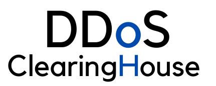

    &nbsp;&nbsp;&nbsp;&nbsp;&nbsp;&nbsp;&nbsp;

    &nbsp;&nbsp;&nbsp;&nbsp;&nbsp;&nbsp;&nbsp;

    &nbsp;&nbsp;&nbsp;&nbsp;&nbsp;&nbsp;&nbsp;

# DDoS Clearing House Documentation

### [Click here](https://github.com/ddos-clearing-house/documentation/wiki) for the wiki-style documentation of the DDoS Clearing House.

## Acknowledgment

<table style="border-collapse: collapse">
   <tr>
      <td>
         
      </td>
      <td>
         This project has received funding from the European Union's Horizon 2020  research and innovation program under grant agreement no. 830927.
      </td>
   </tr>
</table>
